# Domain Model

This diagram describes the initial Cratebase domain model. It is intentionally centered on domain concepts and typed identifiers, not EF Core, API contracts, or database schema.

When the domain model changes, update this diagram in the same pull request.

```mermaid
classDiagram
    direction LR

    namespace SharedKernel {
        class OptionalValue~T~ {
            <<abstract>>
            bool HasValue
        }

        class PresentOptionalValue~T~ {
            T Value
        }

        class MissingOptionalValue~T~ {
        }

        class IEntity~TId~ {
            <<interface>>
        }

        class INamedEntity {
            <<interface>>
            string Name
        }

        class ICreditTarget {
            <<interface>>
        }

        class DomainException

        class ArtistId {
            Guid Value
        }

        class UserId {
            Guid Value
        }

        class CollectionId {
            Guid Value
        }

        class LabelId {
            Guid Value
        }

        class ReleaseId {
            Guid Value
        }

        class TrackId {
            Guid Value
        }

        class OwnedItemId {
            Guid Value
        }

        class CreditId {
            Guid Value
        }

        class ArtistRelationId {
            Guid Value
        }

        class TrackRelationId {
            Guid Value
        }
    }

    namespace Catalog {
        class Artist {
            <<abstract>>
            CollectionId CollectionId
            ArtistId Id
            string Name
        }

        class Person {
        }

        class Group {
        }

        class Label {
            CollectionId CollectionId
            LabelId Id
            string Name
        }

        class Release {
            CollectionId CollectionId
            ReleaseId Id
            ReleaseSummary Summary
            ReleaseTrack[] Tracklist
            Cataloging Cataloging
            UpdateSummary(ReleaseSummary) void
            UpdateCataloging(Cataloging) void
        }

        class ReleaseSummary {
            string Title
            ReleaseMetadata Metadata
            OptionalValue~Rating~ Rating
        }

        class ReleaseMetadata {
            ReleaseType Type
            OptionalValue~LabelId~ LabelId
            OptionalValue~int~ Year
            OptionalValue~DateOnly~ ReleaseDate
            OptionalValue~CoverImage~ CoverImage
        }

        class Cataloging {
            Genre[] Genres
            Tag[] Tags
        }

        class Track {
            CollectionId CollectionId
            TrackId Id
            string Title
            TrackDetails Details
            Cataloging Cataloging
            Rename(string) void
            UpdateDetails(TrackDetails) void
            UpdateCataloging(Cataloging) void
        }

        class TrackDetails {
            OptionalValue~TimeSpan~ Duration
            OptionalValue~Rating~ Rating
        }

        class ReleaseTrack {
            TrackId TrackId
            TrackPosition Position
            OptionalValue~string~ TitleOverride
        }

        class TrackPosition {
            int Number
            OptionalValue~string~ Disc
            OptionalValue~string~ Side
        }

        class ReleaseType {
            <<enum>>
        }

        class CoverImage {
            string Path
        }

        class Genre {
            string Name
        }

        class Tag {
            string Name
        }
    }

    namespace Collection {
        class MusicCollection {
            CollectionId Id
            UserId OwnerUserId
            string Name
            DateTimeOffset CreatedAt
        }

        class OwnedItem {
            CollectionId CollectionId
            OwnedItemId Id
            OwnedItemTarget Target
            OwnedItemHolding Holding
            UpdateHolding(OwnedItemHolding) void
        }

        class OwnedItemHolding {
            OwnershipStatus Status
            IMedium Medium
            OwnedItemDetails Details
        }

        class OwnedItemDetails {
            OptionalValue~ItemCondition~ Condition
            OptionalValue~StorageLocation~ StorageLocation
        }

        class OwnedItemTarget {
            <<abstract>>
        }

        class ReleaseOwnedItemTarget {
            ReleaseId ReleaseId
        }

        class TrackOwnedItemTarget {
            TrackId TrackId
        }

        class IMedium {
            <<interface>>
            string Description
        }

        class DigitalFile {
            FilePath Path
            AudioFileFormat Format
            OptionalValue~FileImportIdentity~ ImportIdentity
        }

        class VinylRecord {
            string FormatDescription
        }

        class CompactDisc {
            int DiscCount
        }

        class CassetteTape {
            string TapeType
        }

        class OtherMedium {
            string Name
        }

        class FilePath {
            string Value
        }

        class FileImportIdentity {
            FilePath Path
            long SizeBytes
            DateTimeOffset LastModifiedAt
            OptionalValue~string~ ContentHash
        }

        class AudioFileFormat {
            <<enum>>
        }

        class OwnershipStatus {
            <<enum>>
        }

        class ItemCondition {
            <<enum>>
        }

        class StorageLocation {
            string Name
        }
    }

    namespace Credits {
        class Credit {
            CollectionId CollectionId
            CreditId Id
            CreditContributor Contributor
            CreditTarget Target
            CreditRole Role
        }

        class CreditContributor {
            ArtistId ArtistId
            string Name
        }

        class CreditTarget {
            <<abstract>>
        }

        class ReleaseCreditTarget {
            ReleaseId ReleaseId
        }

        class TrackCreditTarget {
            TrackId TrackId
        }

        class CreditRole {
            <<enum>>
        }
    }

    namespace Relations {
        class ArtistRelation {
            CollectionId CollectionId
            ArtistRelationId Id
            ArtistId SourceArtistId
            ArtistId TargetArtistId
            ArtistRelationType Type
            OptionalValue~ArtistRelationPeriod~ Period
        }

        class ArtistRelationType {
            <<enum>>
        }

        class ArtistRelationPeriod {
            OptionalValue~int~ StartYear
            OptionalValue~int~ EndYear
        }

        class TrackRelation {
            CollectionId CollectionId
            TrackRelationId Id
            TrackId SourceTrackId
            TrackId TargetTrackId
            TrackRelationType RelationType
        }

        class TrackRelationType {
            <<enum>>
        }
    }

    namespace Ratings {
        class Rating {
            int Value
        }

        class ReleaseTrackRatingSummary {
            OptionalValue~decimal~ AverageRating
            int RatedTrackCount
        }

        class ReleaseTrackRatingCalculator {
            Calculate(Release, Track[]) ReleaseTrackRatingSummary
        }
    }

    IEntity~ArtistId~ <|.. Artist
    IEntity~LabelId~ <|.. Label
    IEntity~ReleaseId~ <|.. Release
    IEntity~TrackId~ <|.. Track
    IEntity~CollectionId~ <|.. MusicCollection
    IEntity~OwnedItemId~ <|.. OwnedItem
    IEntity~CreditId~ <|.. Credit
    IEntity~ArtistRelationId~ <|.. ArtistRelation
    IEntity~TrackRelationId~ <|.. TrackRelation

    INamedEntity <|.. Artist
    OptionalValue~T~ <|-- PresentOptionalValue~T~
    OptionalValue~T~ <|-- MissingOptionalValue~T~
    Artist <|-- Person
    Artist <|-- Group
    ICreditTarget <|.. Release
    ICreditTarget <|.. Track

    Artist --> ArtistId
    Artist --> CollectionId
    Label --> LabelId
    Label --> CollectionId

    Release --> ReleaseId
    Release --> CollectionId
    Release *-- ReleaseSummary
    Release *-- ReleaseTrack : tracklist
    Release *-- Cataloging
    ReleaseSummary *-- ReleaseMetadata
    ReleaseSummary *-- OptionalValue~Rating~ : own rating
    ReleaseMetadata *-- ReleaseType
    ReleaseMetadata *-- OptionalValue~LabelId~ : label
    ReleaseMetadata *-- OptionalValue~int~ : year
    ReleaseMetadata *-- OptionalValue~DateOnly~ : release date
    ReleaseMetadata *-- OptionalValue~CoverImage~ : cover image
    Cataloging o-- Genre
    Cataloging o-- Tag
    ReleaseTrack --> TrackId
    ReleaseTrack *-- TrackPosition

    Track --> TrackId
    Track --> CollectionId
    Track *-- TrackDetails
    Track *-- Cataloging
    TrackDetails *-- OptionalValue~TimeSpan~ : duration
    TrackDetails *-- OptionalValue~Rating~ : own rating

    MusicCollection --> CollectionId
    MusicCollection --> UserId
    OwnedItem --> OwnedItemId
    OwnedItem --> CollectionId
    OwnedItem *-- OwnedItemTarget
    OwnedItem *-- OwnedItemHolding
    OwnedItemHolding *-- OwnershipStatus
    OwnedItemHolding *-- IMedium
    OwnedItemHolding *-- OwnedItemDetails
    OwnedItemDetails *-- OptionalValue~ItemCondition~ : condition
    OwnedItemDetails *-- OptionalValue~StorageLocation~ : storage location
    OwnedItemTarget <|-- ReleaseOwnedItemTarget
    OwnedItemTarget <|-- TrackOwnedItemTarget
    ReleaseOwnedItemTarget --> ReleaseId : release target
    TrackOwnedItemTarget --> TrackId : track target
    IMedium <|.. DigitalFile
    IMedium <|.. VinylRecord
    IMedium <|.. CompactDisc
    IMedium <|.. CassetteTape
    IMedium <|.. OtherMedium
    DigitalFile *-- FilePath
    DigitalFile *-- AudioFileFormat
    DigitalFile *-- OptionalValue~FileImportIdentity~ : import identity
    FileImportIdentity --> FilePath
    FileImportIdentity *-- OptionalValue~string~ : content hash

    Credit --> CreditId
    Credit --> CollectionId
    Credit *-- CreditContributor
    Credit *-- CreditTarget
    Credit *-- CreditRole
    CreditContributor --> ArtistId
    CreditTarget <|-- ReleaseCreditTarget
    CreditTarget <|-- TrackCreditTarget
    ReleaseCreditTarget --> ReleaseId : release target
    TrackCreditTarget --> TrackId : track target

    ArtistRelation --> ArtistRelationId
    ArtistRelation --> CollectionId
    ArtistRelation --> ArtistId : source
    ArtistRelation --> ArtistId : target
    ArtistRelation *-- ArtistRelationType
    ArtistRelation *-- OptionalValue~ArtistRelationPeriod~ : period
    ArtistRelationPeriod *-- OptionalValue~int~ : start year
    ArtistRelationPeriod *-- OptionalValue~int~ : end year

    TrackRelation --> TrackRelationId
    TrackRelation --> CollectionId
    TrackRelation --> TrackId : source
    TrackRelation --> TrackId : target
    TrackRelation *-- TrackRelationType

    ReleaseTrackRatingCalculator ..> Release
    ReleaseTrackRatingCalculator ..> Track
    ReleaseTrackRatingCalculator ..> ReleaseTrackRatingSummary
```

## Domain Boundaries

- Catalog describes canonical artists, labels, releases, tracks, and track appearances.
- Collection describes a user's `MusicCollection` plus owned or wanted items and their concrete medium.
- Credits describe artist contributions to releases or tracks.
- Relations describe artist-to-artist and track-to-track graph edges.
- Ratings are independent for releases and tracks; release track averages are calculated, not stored.
- `MusicCollection` is the ownership boundary. Catalog, credit, relation, and owned-item entities carry `CollectionId`; request handling resolves the current user's default collection and persistence enforces collection-scoped references.
- Digital file import identity supports idempotent local audio folder imports.
- Optional domain data uses `OptionalValue<T>` instead of nullable properties, nullable parameters, or `null` sentinel values.
- Variant references such as owned-item targets and credit targets use distinct subtypes instead of nullable paired identifiers.
- Public mutation paths preserve aggregate identity and keep invariants inside the domain model: `Track.Rename`, `Track.UpdateDetails`, `Track.UpdateCataloging`, `Release.UpdateSummary`, `Release.UpdateCataloging`, and `OwnedItem.UpdateHolding`.
- Closed domain choices with no variant-specific behavior use enums. Domain choices must not be open string-code value objects; string representations belong at API, persistence, import, and export boundaries.
- SharedKernel contains typed identifiers, optional values, capability interfaces, validation support, and domain exceptions.
